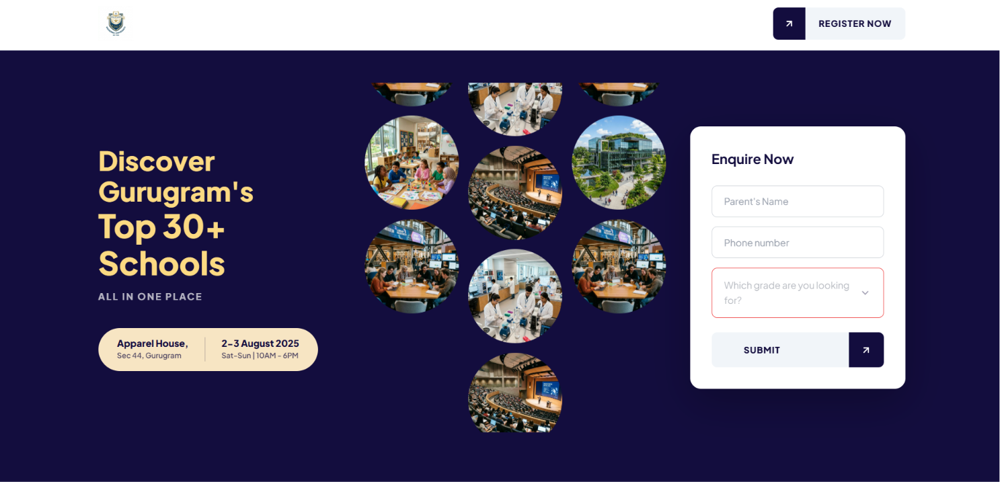
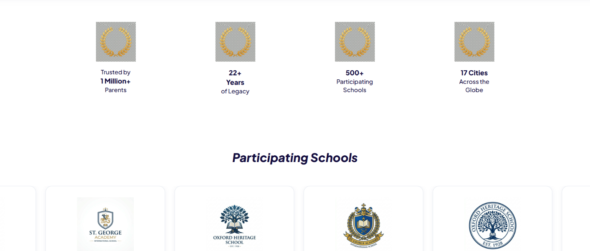
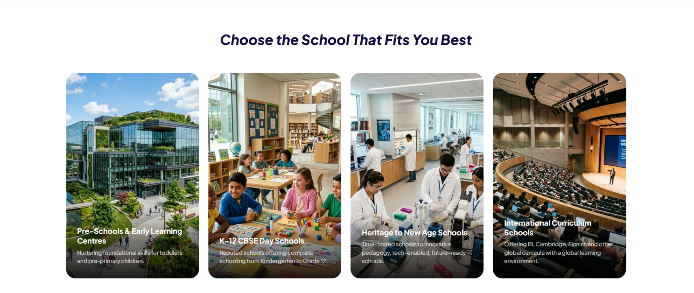
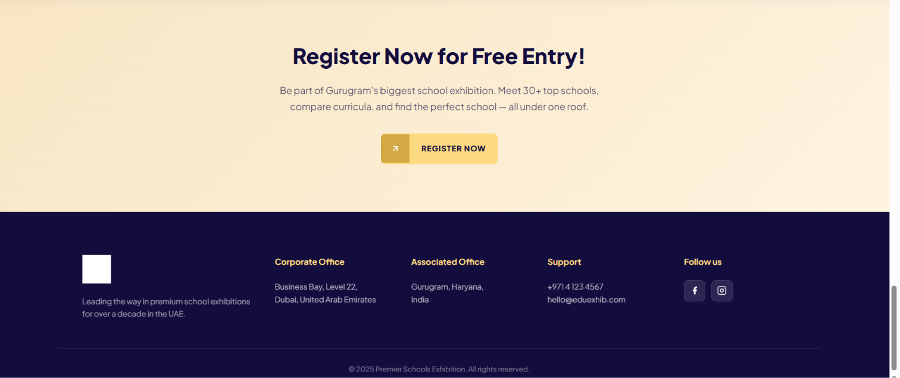
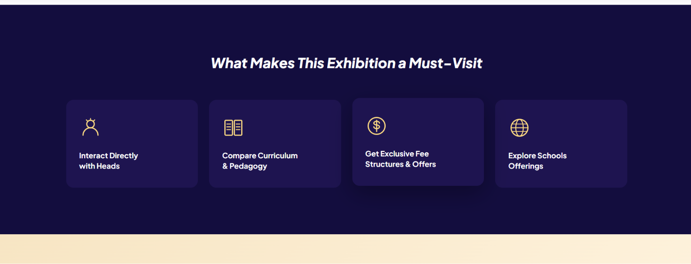

# 🎓 Premier School Landing Page

A responsive and modern landing page for **Premier School**, built using **HTML, CSS, and JavaScript**. The project focuses on creating an attractive and user-friendly interface to showcase school information.

## 🚀 Features

* Responsive Design
* Modern UI/UX
* Hero Section
* About Section
* Gallery
* Contact Section
* Smooth Navigation
* Mobile-Friendly Layout

## 🛠️ Technologies Used

* HTML5
* CSS3
* JavaScript

## 📂 Project Structure

- index.html
- style.css
- script.js
- images/
- home.png
- about.png
- gallery.png
- contact.png
- visit.png

## ▶️ How to Run

1. Clone or download this repository.
2. Open the project folder.
3. Open `index.html` in your browser.

## 📸 Screenshots

### Home Page

### About Section

### Gallery

### Contact Section

### Mobile View

## 👨‍💻 Author

**Rizwan Khan**

GitHub: https://github.com/rizwankhan942578-coder

⭐ If you like this project, consider giving it a star.
